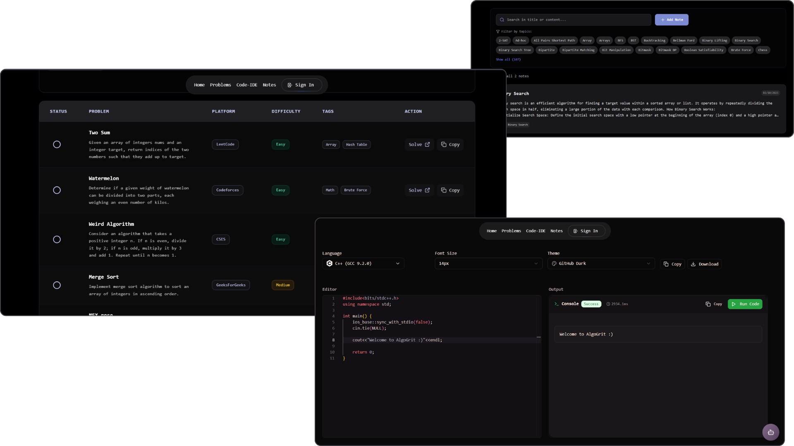

# AlgoGrit DSA 👩🏻‍💻

<p align="center">
	
	<br/><br/>
</p>

AlgoGrit is a focused learning environment for mastering Data Structures & Algorithms. It combines a problems dashboard, personal notes, an embedded code playground, and an AI assistant wrapped in a performant, accessible Next.js UI.

---

## Table of Contents
- [Features](#features)
- [Tech Stack](#tech-stack)
- [Environment Variables](#environment-variables)
- [Getting Started](#getting-started)
- [Contributing](#contributing)

---

## Features

| Area | Highlights |
|------|-----------|
| Problems Dashboard | Filter by difficulty / tags, view stats, progressive enhancement UI |
| Notes | Full CRUD, tag filtering, pagination, search, empty & status states |
| Code IDE | Monaco editor integration, language selector, output panel, code download |
| AI Assistant | Contextual DSA Q&A, markdown + syntax highlighting, code copy buttons, local history persistence |
---

## Tech Stack

- **Framework**: Next.js 15 (App Router)
- **Language**: TypeScript + React 19
- **Styling**: Tailwind CSS + custom CSS vars (OKLCH palette)
- **Animation**: Framer Motion
- **Auth & Data**: Firebase Auth + Firestore
- **AI**: Google Gemini API (primary) → Hugging Face Inference (fallback) → Local `node-nlp` micro-corpus (final fallback)
- **Editor**: Monaco via `@monaco-editor/react`
- **Markdown**: `react-markdown`, `remark-gfm`, `rehype-highlight`
- **Validation**: Zod (forms where applicable)

---


## Environment Variables

Create a `.env.local` file (never commit secrets):

```
NEXT_PUBLIC_FIREBASE_API_KEY=your_api_key
NEXT_PUBLIC_FIREBASE_AUTH_DOMAIN=your_auth_domain
NEXT_PUBLIC_FIREBASE_PROJECT_ID=your_project_id
NEXT_PUBLIC_FIREBASE_STORAGE_BUCKET=your_storage_bucket
NEXT_PUBLIC_FIREBASE_MESSAGING_SENDER_ID=your_messaging_sender_id
NEXT_PUBLIC_FIREBASE_APP_ID=your_app_id

# Primary AI provider key (server side)
GEMINI_API_KEY=your_gemini_server_key

# Optional fallback (uncomment if using Hugging Face)
# HUGGING_FACE_API_KEY=your_hf_key
# HF_MODEL=mistralai/Mistral-7B-Instruct-v0.3
```

If both remote providers fail or keys are missing, the app falls back to a small local `node-nlp` corpus (see `src/lib/assistantCorpus.ts`).

---

## Getting Started

1. **Clone**
   ```bash
   git clone https://github.com/shwet46/algogrit-dsa.git
   cd algogrit-dsa
   ```
2. **Install Dependencies**
   ```bash
   npm install
   ```
3. **Configure Firebase & Env Vars** (see above + `firestore.rules`)
4. **Run Dev Server**
   ```bash
   npm run dev
   ```
5. Visit: http://localhost:3000

---


## Contributing

1. Fork & create a feature branch
2. Keep changes atomic and focused
3. Run lint & format before pushing
4. Open a PR with a clear description & screenshots (if UI)

---

If AlgoGrit helps you learn faster, consider starring the repo ⭐️  it helps others discover it.

Happy coding & algorithm grinding! 🚀